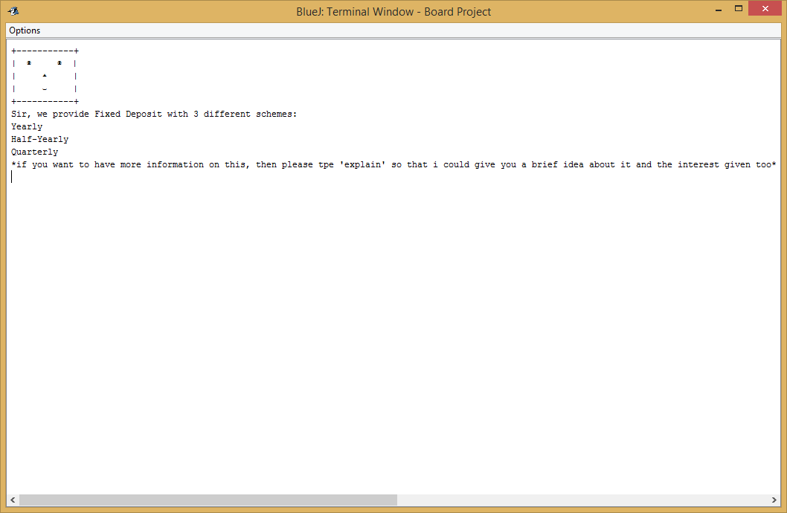

# Personal Assistant for Bank

My Grade 10 ISCE Board Project
 Subject: Computer Application 

### Current System

- You have to go to the Bank for information and update process.
- You need a person to help you with the information.
- You need to go to different department for different information and wait in long ques.
- Or you need a person to chat with you on the other side.
- It is tedious and consumes time.
- You can visit Bank on specific days and on specific timings.

### Proposed System

- You will have to chat with a simple chat-bot which gives you information regarding this bank.
- It understands language of banking only related to this bank only as it is specially made for this bank.
- Just enter the department of which you need update and the chat-bot will help you in it.
- It has all the facilities that the bank serves.
- It is connected online and has login feature to keep your account secure.

### Advantages

- No need to go to bank for information when you have the bank with you.
- The program gives you a polite, smart and convenient to chat chat-bot with you.
- No need to wait in long ques for different departments for different information when you have a chat-bot to give you updates from each departments. Only you have to enter the department you want to receive the update from.
- No need for a person to sit on the other side to give you information when you have a simple chat-bot to provide you information related to the bank.
- It saves time as you have to just enter what information you need and it gives you in no time.
- You can use it at any time you like.

### Software Requirements

- BlueJ environment or any other environment with Java as the base.
- BlueJ version 3.1.0 and above.
- Java Version 7 Update 45 and above.
- Software Size: 16.0 MB.

### Hardware Requirements

- KVM (Keyboard Video Mouse (Mouse not needed inside the program)).

### Modules

- Login: For secure purpose.
- Passbook Update: Current Balance Passbook.
- Account Details: Your account’s status.
- Account Types: Account types offered.
- Loan: Loan regarding details.

### Package Description

Package Menu: 
- It has the Class Menu which is Menu for the Project.
- It calls Package Account.

Package Account:
- It has Class Account which ensures login feature and after login retrives basic data from the account and gives it to the Assistant.
- It calls Package Assistant.

Package Assistant:	
- It has Class Assistant where the whole program revolves.
- Once called, Assistant is started and helps the user to retrive data and update his account.
- It calls Package Departments.

Package Departments:
- It has Class Loan, Fixed\_Deposit, Recurring\_Deposit and Savings\_Account.
- User can retrive or update information from these Departments,.
- If no account for Department has been created then user is asked to create if he/she likes.
- It calls Package Assistant back again after work is done.

Package Delay:
- It is an important package which has Class Delay.
- It does not calls any Package but is called by every Package as it is responsible for delaying the program for few moments.

Package Year:
- It has class Year.
- It calls no package but is called by Package Account and Departments.
- It gives the age of the user by checking his Birthyear.
- It gives the current date to Package Departments so that it can use the date to update information.

# How to Run Project
- Start by Compiling and running class "Menu" from package "Menu"
- The account number and password for the only 3 users are present in "Profiles.txt".
- Every account number has 5 digit and password has 3 characters.

### Screenshots

Start:

  
  

  
  

Command: Account details  

  
  

                                                    
Command: Balance Details     

  
  

 

Command: Fixed Deposit   

  
  

 

  
  

 
                                             

Command: Good Bye

  

 
